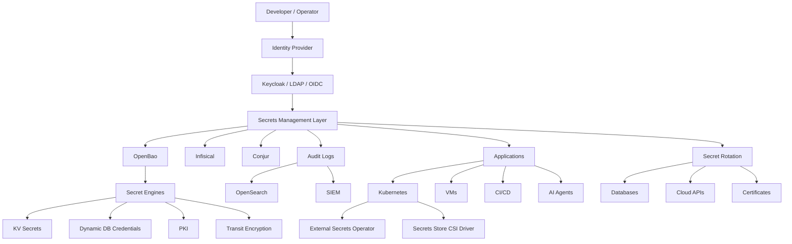
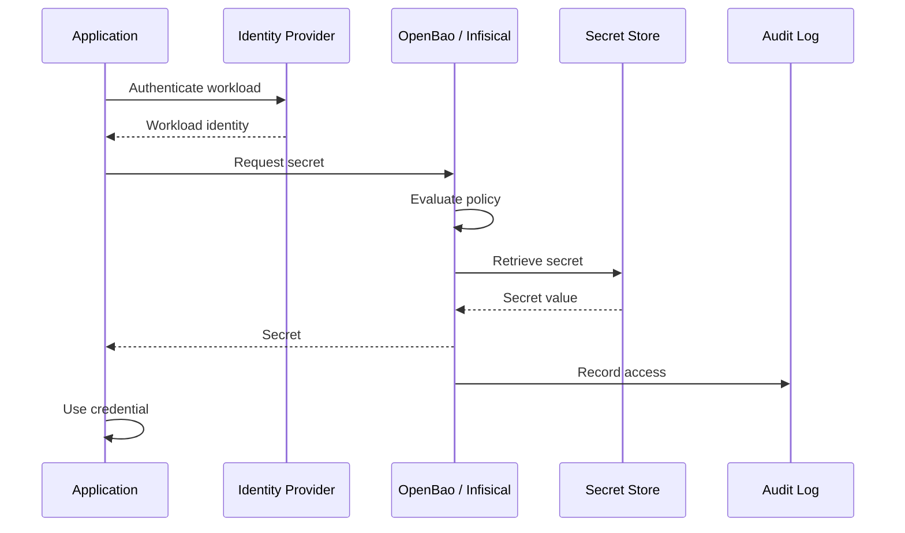
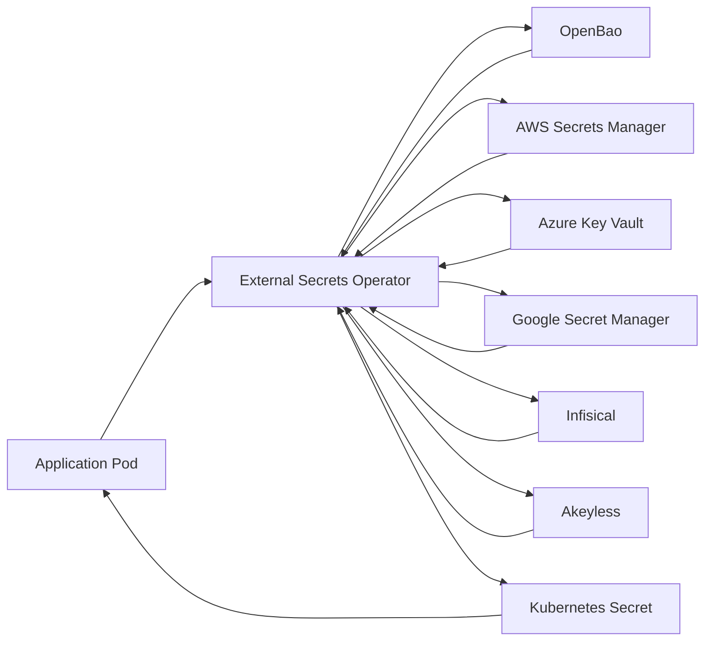
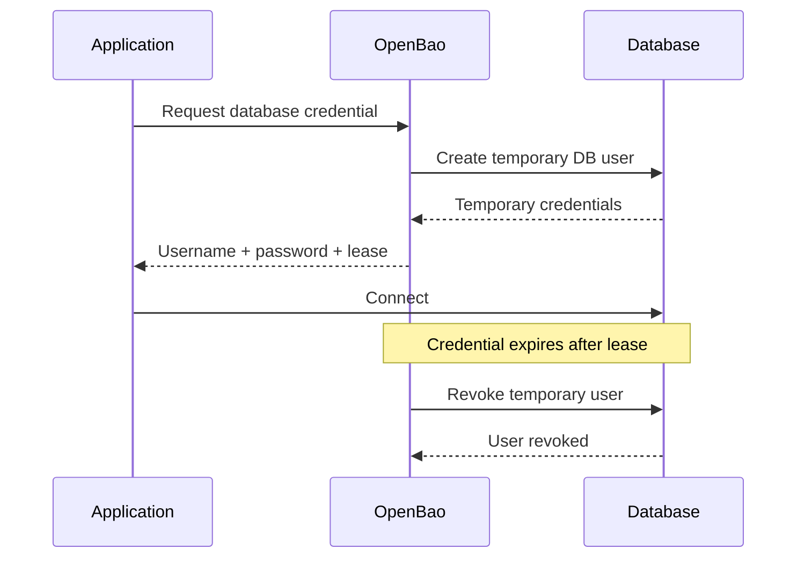
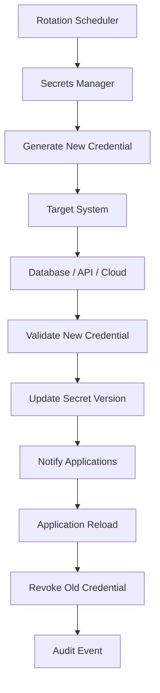

# Awesome-Secrets-Management-Platform

## Top Secrets Management Platforms


A curated **GitHub-style reference list of enterprise Secrets Management platforms**, covering commercial SaaS/hosted products and open-source/self-hosted alternatives.


The primary emphasis is on **open-source software that can be self-hosted**, while keeping commercial SaaS/hosted platforms in a separate section.


Modern secrets-management platforms typically provide:


* Centralized secret storage

* Application and machine identity

* Fine-grained access control

* Secret versioning

* Secret rotation

* Dynamic secrets

* Short-lived credentials

* Encryption as a service

* PKI / certificates

* KMS integration

* Cloud-provider integration

* Kubernetes integration

* CI/CD integration

* Environment-variable injection

* API / CLI / SDK access

* Audit logging

* SSO / LDAP / OIDC / SAML

* MFA

* Secret scanning

* Secret-leak detection

* Just-in-time access

* Break-glass access

* Policy enforcement

* High availability

* Disaster recovery


> **Important:** A password manager, encrypted `.env` file and secrets manager are not necessarily equivalent. Enterprise secrets management usually involves machine identity, automated retrieval, rotation, policy enforcement, auditing and workload integration.


---


## Table of Contents


* [SaaS/Hosted Platforms](#saashosted-platforms)

* [Open-Source](#open-source)


  * [Full Secrets Management Platforms](#full-secrets-management-platforms)

  * [GitOps / Encrypted Secrets](#gitops--encrypted-secrets)

  * [Kubernetes Secrets Management](#kubernetes-secrets-management)

  * [Team Password & Secret Managers](#team-password--secret-managers)

  * [CLI / Developer Secrets Managers](#cli--developer-secrets-managers)

  * [Secret Injection & Delivery](#secret-injection--delivery)

  * [Secret Detection & Leak Prevention](#secret-detection--leak-prevention)

  * [Encryption & Key Management Building Blocks](#encryption--key-management-building-blocks)

* [Commercial → Open-Source Mapping](#commercial--open-source-mapping)

* [Reference Architecture](#reference-architecture)

* [Application Secret Retrieval](#application-secret-retrieval)

* [Kubernetes Secrets Workflow](#kubernetes-secrets-workflow)

* [GitOps Secrets Workflow](#gitops-secrets-workflow)

* [Dynamic Secrets Workflow](#dynamic-secrets-workflow)

* [Secret Rotation Workflow](#secret-rotation-workflow)

* [Capability Matrix](#capability-matrix)

* [Recommended Open-Source Stacks](#recommended-open-source-stacks)

* [Best Open-Source Choices by Requirement](#best-open-source-choices-by-requirement)

* [What Open Source Can and Cannot Replace](#what-open-source-can-and-cannot-replace)

* [Why Open Source Is Attractive](#why-open-source-is-attractive)

* [Security Architecture](#security-architecture)

* [Important Licensing Considerations](#important-licensing-considerations)

* [Conclusion](#conclusion)

* [Contributing](#contributing)

* [Disclaimer](#disclaimer)


---


# SaaS/Hosted Platforms

These are **commercial platforms** and are deliberately kept separate from the open-source ecosystem.

> 📊 **Market Size & Landscape Dynamics:** The global secrets management and non-human identity security market is estimated at **$2.5B–$3.5B** (growing at ~26% CAGR toward $9B+ by 2030). The sector is **moderately fragmented**: while cloud hyperscalers (Microsoft, AWS, Google Cloud) and incumbent security titans (IBM/HashiCorp, CyberArk) dominate enterprise infrastructure and baseline storage, specialized developer-focused and vaultless innovators (Infisical, Doppler, 1Password, Bitwarden, Akeyless) capture substantial greenfield workload share, preventing a single winner-take-all monopoly.

| Platform | Primary Focus | Company Size (Valuation / Revenue) | Typical Strengths | Pricing | Free Tier Limit |
| --- | --- | --- | --- | --- | --- |
| [Azure Key Vault](https://azure.microsoft.com/en-us/products/key-vault/) | Azure secrets / keys | ~$3.1T Market Cap (~$245B Rev) | Secrets, certificates, keys, managed identities | $0.03 per 10,000 operations for secrets & software keys ($3.00/certificate renewal; no secret storage fee) | 30-day free trial with $200 Azure credits; no ongoing base monthly subscription fee on pay-as-you-go |
| [Azure Managed HSM](https://azure.microsoft.com/en-us/products/managed-hsm) | HSM / keys | ~$3.1T Market Cap (~$245B Rev) | Hardware-backed key management | Starts at $3.20/hour (~$2,336/month) per B1 instance pool (includes 3 HSM partitions) | 30-day free trial via $200 Azure new account credit (covers ~62.5 hours of testing; no permanent free tier) |
| [Google Secret Manager](https://cloud.google.com/security/products/secret-manager) | GCP-native secrets | ~$2.1T Market Cap (~$350B Rev) | IAM, versioning, audit, GCP integration | $0.06 per active secret version/month + $0.03 per 10,000 access operations + $0.05 per rotation notification | Free forever for 6 active secret versions, 10,000 access operations, and 3 rotation notifications per month (plus $300 90-day GCP trial credit) |
| [Google Cloud Secret Manager](https://cloud.google.com/secret-manager) | Cloud secrets | ~$2.1T Market Cap (~$350B Rev) | GCP IAM, versioning and audit | $0.06 per active secret version/month + $0.03 per 10,000 access operations + $0.05 per rotation notification | Free forever for 6 active secret versions, 10,000 access operations, and 3 rotation notifications per month (plus $300 90-day GCP trial credit) |
| [Google Cloud KMS](https://cloud.google.com/kms) | Key management | ~$2.1T Market Cap (~$350B Rev) | Cloud-native cryptographic key management | $0.06 per active key version/month + $0.03 per 10,000 cryptographic operations (software keys; admin ops free) | Free forever for up to 100 active key versions and 10,000 operations per month via Cloud KMS Autokey (plus $300 90-day GCP trial credit) |
| [AWS Secrets Manager](https://aws.amazon.com/secrets-manager/) | AWS-native secrets | ~$2.0T Market Cap (~$600B Rev) | Rotation, IAM integration, AWS services | $0.40 per secret/month + $0.05 per 10,000 API calls | 30-day free trial per secret from creation (plus $200 free tier credits for new AWS accounts for 6 months) |
| [AWS KMS](https://aws.amazon.com/kms/) | Key management | ~$2.0T Market Cap (~$600B Rev) | Encryption keys, cryptographic operations | $1.00 per customer managed key/month + $0.03 per 10,000 requests (AWS managed keys have no storage fee) | Free forever for 20,000 requests per month across all regions (excludes asymmetric keys; plus $200 new account credits) |
| [Oracle Cloud Vault](https://www.oracle.com/security/cloud-security/key-management/) | Keys / secrets | ~$400B Market Cap (~$53B Rev) | OCI-native key and secret management | Free for software keys & secrets; $0.53 per HSM key version/month beyond 20 free versions (Private Vaults at $2.69/hour) | Always Free tier includes unlimited software keys, 150 secrets (40 versions each), and first 20 HSM key versions free (plus $300 30-day trial credits) |
| [IBM Cloud Secrets Manager](https://www.ibm.com/products/secrets-manager) | Cloud secrets | ~$210B Market Cap (~$62B Rev) | Centralized secret storage and certificate management | Standard plan starts at $324/instance/month + $2.17 per 10 active secrets/month ($0.217 per active secret) | 30-day free trial with 1 trial instance and unlimited access to all service capabilities |
| [CyberArk Conjur / Secrets Manager](https://www.cyberark.com/products/secrets-management) | Machine identity / DevOps secrets | ~$12B Market Cap (~$1.0B Rev) | Workload identity, policy, privileged access | Commercial enterprise packages start at ~$23,328/year (~$1,944/month for 20 users / ~$1,000–$1,500 per identity/year) | Free forever for Conjur Open Source (OSS) with core CLI/API/SDK features; enterprise evaluation via 30-day guided POC |
| [1Password](https://1password.com/) | Human + machine credentials | ~$6.8B Valuation (~$250M+ ARR) | Enterprise password and secrets management | Individual at $2.99/month; Teams Starter Pack at $19.95/month for 10 users; Business at $7.99/user/month (billed annually) | 14-day free trial with full feature access across apps and browser extensions |
| [1Password Secrets Automation](https://developer.1password.com/docs/secrets-automation/) | Developer / machine secrets | ~$6.8B Valuation (~$250M+ ARR) | Service accounts, CLI, SDKs, Connect | Included with 1Password Business at $7.99/user/month billed annually ($8.99 billed monthly; includes 3 service accounts) | 14-day free trial of 1Password Business with service account automation capabilities |
| [HashiCorp Vault](https://www.hashicorp.com/en/products/vault) | Enterprise secrets / identity security | $6.4B Valuation (Acquired by IBM) | Dynamic secrets, PKI, encryption, identity-based access | Enterprise license starts at ~$15,000/year (or self-hosted Community Edition under BSL 1.1) | Community Edition free for internal/lab use; Enterprise offers a 30-day proof-of-concept trial |
| [HCP Vault](https://www.hashicorp.com/en/products/vault) | Managed Vault | $6.4B Valuation (Acquired by IBM) | Hosted Vault, cloud operations, enterprise security | $0.03/hour (~$22/month) for Dev cluster; Starter clusters start at $0.53/hour (~$380/month) | 30-day trial with $500 free credits across HashiCorp Cloud Platform |
| [BeyondTrust Password Safe](https://www.beyondtrust.com/products/password-safe) | Privileged access | ~$3.0B Valuation (~$400M ARR) | PAM, credential management, privileged sessions | Starts at ~$157 per managed asset/year (~$13.08/asset/month) or ~$3,139/month for 500 managed assets | 30-day enterprise Proof of Concept (POC) trial available on request |
| [Delinea Secret Server](https://delinea.com/products/secret-server) | PAM / secrets | ~$2.5B Valuation (~$300M ARR) | Privileged credentials, discovery, rotation | Starts at ~$8 to $14 per privileged account/month ($96 to $168/account/year; base entry contracts starting ~$10,000/year) | 30-day free trial for up to 10 users (free single-user evaluation edition available) |
| [Keeper Enterprise](https://www.keepersecurity.com/enterprise.html) | Enterprise credential security | ~$1.5B Valuation (~$120M ARR) | Passwords, secrets, privileged access | Keeper Business starts at $3.75/user/month; Keeper Enterprise starts at $6.00/user/month ($72/user/year billed annually) | 14-day free trial for business and enterprise plans |
| [Keeper Secrets Manager](https://www.keepersecurity.com/secrets-manager.html) | Machine secrets | ~$1.5B Valuation (~$120M ARR) | API-driven secrets, DevOps, zero-knowledge architecture | Starts at $1.00–$3.00/user/month as add-on (or standalone plans starting at ~$3,000/year) | 14-day free trial with full API, SDK, and CLI secrets management access |
| [StrongDM](https://www.strongdm.com/) | Infrastructure access | ~$1.0B Valuation (~$50M ARR) | Zero-trust access, identity-aware infrastructure access | Starts at $70/user/month (all resources included: servers, databases, clusters) | 14-day free trial with full access to all zero-trust access management capabilities |
| [Bitwarden Secrets Manager](https://bitwarden.com/products/secrets-manager/) | Machine secrets | ~$500M Valuation (~$50M ARR) | Secrets for developers and infrastructure | Teams tier starts at $6/user/month (billed annually) with 20 machine accounts; Enterprise at $12/user/month | Free forever plan for up to 2 users, 3 projects, and 3 machine accounts with unlimited secret storage |
| [Pulumi ESC](https://www.pulumi.com/product/secrets-management/) | Environment / secrets management | ~$400M Valuation (~$30M ARR) | Cloud secrets aggregation and environment configuration | Team Edition starts at $0.50 per secret/month + $0.10 per 10,000 API calls (overage); Enterprise at $0.75 per secret/month | Free forever for up to 25 secrets and 10,000 API calls per month (plaintext config is unlimited and free) |
| [GitGuardian Internal Monitoring](https://www.gitguardian.com/internal-monitoring) | Secret detection | ~$300M Valuation (~$25M ARR) | Secret discovery, remediation, developer security | Business tier starts at $18/contributing developer/month (or $220/developer/year) | Free forever for teams with up to 25 contributing developers on private collaborative repositories (or 14-day trial of Business tier) |
| [Doppler](https://www.doppler.com/) | Developer secrets / configuration | ~$150M Valuation (~$15M ARR) | Environment synchronization, integrations, developer UX | $8/user/month for additional seats; Team plan starts at $21/user/month ($18 billed annually) | Free forever for up to 3 users, 10 projects, 4 environments/project, 10 configs/environment, and 3-day logs |
| [Infisical](https://infisical.com/) | Developer secrets platform | ~$120M Valuation (~$10M ARR) | Secrets, certificates, secret scanning, developer workflows | $18/user/month (or $10/user/month billed annually) for Pro tier | Free forever for up to 5 identities (human + machine), 3 projects, 3 environments/project, and 10 integrations |
| [Akeyless](https://www.akeyless.io/) | Cloud secrets management | ~$100M Valuation (~$12M ARR) | Zero-knowledge architecture, dynamic secrets, DFC, hybrid access | Starts at ~$2,500/year (~$208/month) for commercial plans / ~$0.50–$1.00 per client/month | Free forever for up to 5 clients (identities), 2,000 static secrets, 5 dynamic secrets, 5 rotated secrets, 1 gateway, and 3-day logs |


---


# Secrets Management vs Adjacent Platforms


The commercial products above do not all solve exactly the same problem.


```text

                         Secrets & Identity

                                │

       ┌────────────────────────┼────────────────────────┐

       │                        │                        │

       ▼                        ▼                        ▼

 Secret Management         Privileged Access       Secret Detection

       │                        │                        │

   Vault                    StrongDM                 GitGuardian

   Infisical                CyberArk                 Gitleaks

   Doppler                  Delinea                  TruffleHog

   Akeyless                 BeyondTrust               ggshield

       │

       ▼

 Cloud Secrets

       │

 AWS Secrets Manager

 Azure Key Vault

 Google Secret Manager

```


---


# Open-Source


The open-source ecosystem is much broader than a single category.


It includes:


```text

Full Secrets Manager

        +

Encrypted GitOps

        +

Kubernetes Secret Delivery

        +

Password / Team Secret Managers

        +

Secret Injection

        +

Secret Detection

        +

Encryption / KMS

```


---

## 🌟 Open-Source Secrets Management Leaderboard

All open-source repositories ranked by GitHub stars in descending order:

| Rank | Project | GitHub Stars | Category | Primary Focus |
| :---: | --- | :---: | --- | --- |
| 1 | [Vaultwarden](https://github.com/dani-garcia/vaultwarden) | [](https://github.com/dani-garcia/vaultwarden/stargazers) | Team / Password Manager | Lightweight Rust implementation of Bitwarden backend |
| 2 | [OpenSSL](https://github.com/openssl/openssl) | [](https://github.com/openssl/openssl/stargazers) | Cryptography & TLS | Foundation cryptographic library and TLS toolkit |
| 3 | [Infisical](https://github.com/Infisical/infisical) | [](https://github.com/Infisical/infisical/stargazers) | Full Secrets Platform | End-to-end secrets, PKI, and privileged access management |
| 4 | [Gitleaks](https://github.com/gitleaks/gitleaks) | [](https://github.com/gitleaks/gitleaks/stargazers) | Secret Detection | Fast, standalone git secret & credential scanner |
| 5 | [KeePassXC](https://github.com/keepassxreboot/keepassxc) | [](https://github.com/keepassxreboot/keepassxc/stargazers) | Team / Password Manager | Cross-platform community password & credential manager |
| 6 | [TruffleHog](https://github.com/trufflesecurity/trufflehog) | [](https://github.com/trufflesecurity/trufflehog/stargazers) | Secret Detection | Deep credential hunting & automated verification |
| 7 | [age](https://github.com/FiloSottile/age) | [](https://github.com/FiloSottile/age/stargazers) | GitOps / Cryptography | Modern file encryption tool with small explicit keys |
| 8 | [SOPS](https://github.com/getsops/sops) | [](https://github.com/getsops/sops/stargazers) | GitOps / Encrypted Secrets | Encrypted files with KMS, age, and PGP integration |
| 9 | [Bitwarden Server](https://github.com/bitwarden/server) | [](https://github.com/bitwarden/server/stargazers) | Team / Password Manager | Enterprise password and secrets management backend |
| 10 | [Semgrep](https://github.com/semgrep/semgrep) | [](https://github.com/semgrep/semgrep/stargazers) | Secret Detection / SAST | Code analysis & semantic pattern secret detector |
| 11 | [git-secrets](https://github.com/awslabs/git-secrets) | [](https://github.com/awslabs/git-secrets/stargazers) | Secret Detection | AWS-developed pre-commit git secret blocker |
| 12 | [git-crypt](https://github.com/AGWA/git-crypt) | [](https://github.com/AGWA/git-crypt/stargazers) | GitOps / Encrypted Secrets | Transparent repository file encryption for git |
| 13 | [Sealed Secrets](https://github.com/bitnami-labs/sealed-secrets) | [](https://github.com/bitnami-labs/sealed-secrets/stargazers) | Kubernetes Secrets | One-way encrypted Kubernetes Secrets controller |
| 14 | [step-ca](https://github.com/smallstep/certificates) | [](https://github.com/smallstep/certificates/stargazers) | PKI / Certificate Authority | Automated private CA, X.509, ACME, and SSH credentials |
| 15 | [OpenBao](https://github.com/openbao/openbao) | [](https://github.com/openbao/openbao/stargazers) | Full Secrets Platform | OpenSSF-governed fork of HashiCorp Vault |
| 16 | [gopass](https://github.com/gopasspw/gopass) | [](https://github.com/gopasspw/gopass/stargazers) | CLI / Developer Secrets | Team password and secret manager for CLI workflows |
| 17 | [External Secrets Operator](https://github.com/external-secrets/external-secrets) | [](https://github.com/external-secrets/external-secrets/stargazers) | Kubernetes Secrets | Synchronizes external secrets APIs directly to K8s |
| 18 | [Passbolt](https://github.com/passbolt/passbolt_api) | [](https://github.com/passbolt/passbolt_api/stargazers) | Team Password Manager | Open-source API and team password manager with OpenPGP |
| 19 | [detect-secrets](https://github.com/Yelp/detect-secrets) | [](https://github.com/Yelp/detect-secrets/stargazers) | Secret Detection | Yelp baseline-based secret scanner for enterprise CI/CD |
| 20 | [Teller](https://github.com/spectralops/teller) | [](https://github.com/spectralops/teller/stargazers) | CLI / Developer Secrets | Multi-vault secret manager for development and CI/CD |
| 21 | [Keywhiz](https://github.com/square/keywhiz) | [](https://github.com/square/keywhiz/stargazers) | Full Secrets Platform | Square's infrastructure secret distribution platform |
| 22 | [Chamber](https://github.com/segmentio/chamber) | [](https://github.com/segmentio/chamber/stargazers) | CLI / Cloud Secrets | Segment's CLI for AWS Systems Manager Parameter Store |
| 23 | [Bank-Vaults](https://github.com/bank-vaults/bank-vaults) | [](https://github.com/bank-vaults/bank-vaults/stargazers) | Kubernetes / Secret Injection | Vault operator & mutating webhook for container injection |
| 24 | [Envconsul](https://github.com/hashicorp/envconsul) | [](https://github.com/hashicorp/envconsul/stargazers) | Secret Injection | Environment variable injection from Consul and Vault |
| 25 | [Credstash](https://github.com/fugue/credstash) | [](https://github.com/fugue/credstash/stargazers) | CLI / Cloud Secrets | Lightweight KMS and DynamoDB credential storage |
| 26 | [ggshield](https://github.com/GitGuardian/ggshield) | [](https://github.com/GitGuardian/ggshield/stargazers) | Secret Detection | GitGuardian CLI for pre-commit and pipeline scanning |
| 27 | [TeamPass](https://github.com/nilsteampassnet/TeamPass) | [](https://github.com/nilsteampassnet/TeamPass/stargazers) | Team Password Manager | Collaborative team password & credential manager |
| 28 | [Secrets Store CSI Driver](https://github.com/kubernetes-sigs/secrets-store-csi-driver) | [](https://github.com/kubernetes-sigs/secrets-store-csi-driver/stargazers) | Kubernetes Secrets | Official Kubernetes SIG secrets volume driver |
| 29 | [Secretlint](https://github.com/secretlint/secretlint) | [](https://github.com/secretlint/secretlint/stargazers) | Secret Detection | Pluggable credential linting engine |
| 30 | [Knox](https://github.com/pinterest/knox) | [](https://github.com/pinterest/knox/stargazers) | Full Secrets Platform | Pinterest's cryptographic key and secret management service |
| 31 | [SoftHSM2](https://github.com/opendnssec/SoftHSMv2) | [](https://github.com/opendnssec/SoftHSMv2/stargazers) | HSM / Cryptography | Software implementation of a PKCS#11 cryptographic HSM |
| 32 | [GnuPG](https://github.com/gpg/gnupg) | [](https://github.com/gpg/gnupg/stargazers) | Cryptography / PGP | Complete OpenPGP standard cryptographic suite |
| 33 | [CyberArk Conjur](https://github.com/cyberark/conjur) | [](https://github.com/cyberark/conjur/stargazers) | Machine Identity / Secrets | Workload identity and access control platform |
| 34 | [KSOPS](https://github.com/viaduct-ai/kustomize-sops) | [](https://github.com/viaduct-ai/kustomize-sops/stargazers) | GitOps Secrets | Kustomize plugin for SOPS-encrypted resources |
| 35 | [Vals](https://github.com/helmfile/vals) | [](https://github.com/helmfile/vals/stargazers) | GitOps / Secret Injection | Multi-backend secret configuration loader |
| 36 | [Psono](https://github.com/psono/psono-server) | [](https://github.com/psono/psono-server/stargazers) | Team Password Manager | Zero-knowledge team password manager server |

---

# Full Secrets Management Platforms


## 1. OpenBao [](https://github.com/openbao/openbao/stargazers)


https://github.com/openbao/openbao


https://openbao.org/


**OpenBao is one of the most important open-source alternatives to HashiCorp Vault.**


OpenBao is a community-driven secrets and encryption-management system under the OpenSSF umbrella. It supports secure secret storage, dynamic secrets, encryption as a service and identity-based access control. ([openbao.org](https://openbao.org/))


### Features


* Secret storage

* Dynamic secrets

* Authentication methods

* ACL policies

* Identity management

* Encryption as a service

* PKI

* Database credentials

* Cloud credentials

* Kubernetes integration

* Audit logging

* Secret leasing

* Revocation

* Transit encryption

* CLI

* API

* UI

* High availability


### Best OSS equivalent for


```text

HashiCorp Vault

        ↓

    OpenBao

```


OpenBao is particularly important for organizations seeking a community-governed open-source Vault-style platform. ([github.com](https://github.com/openbao/openbao))


---


# 2. Infisical [](https://github.com/Infisical/infisical/stargazers)


https://github.com/Infisical/infisical


https://infisical.com/


Infisical is an open-source secrets platform covering secrets, certificates, privileged access and secret scanning.


The repository is available under an MIT-based open-source model, while its `ee` directory contains enterprise features under a separate license. ([github.com](https://github.com/Infisical/infisical))


### Features


* Secrets management

* Environment management

* Development / staging / production separation

* Secret versioning

* Secret injection

* CLI

* SDKs

* Kubernetes integration

* CI/CD integration

* Internal PKI

* Certificate management

* Secret scanning

* Machine identity

* Dynamic secrets

* Web dashboard

* Self-hosting


### Best for


```text

Doppler

   +

Developer-friendly Vault

   +

Secret scanning

   +

PKI

```


---


# 3. CyberArk Conjur Open Source [](https://github.com/cyberark/conjur/stargazers)


https://github.com/cyberark/conjur


https://cyberark.github.io/conjur/


CyberArk Conjur provides secrets management and application/machine identity for infrastructure.


The open-source Conjur server is LGPLv3 licensed; CyberArk also offers commercial Secrets Manager products. ([github.com](https://github.com/cyberark/conjur))


### Features


* Machine identity

* Application identity

* RBAC

* Policy-as-code

* Secret storage

* REST API

* Authentication

* Kubernetes integration

* OpenShift integration

* AWS IAM authentication

* OIDC

* Secret rotation

* Audit

* CI/CD integrations


Conjur's architecture is particularly focused on **machine identities and workload access** rather than being merely a password vault.


### Best for


```text

CyberArk Conjur

     ↓

Cloud-native workload secrets

     ↓

Machine identity + policy

```


---


# 4. Bitwarden [](https://github.com/bitwarden/server/stargazers)


https://github.com/bitwarden


https://bitwarden.com/


Bitwarden is a major open-source password and credential-management ecosystem.


Its source repositories include server and client components, although individual repository licensing should be checked before treating the entire product as uniformly licensed. ([github.com](https://github.com/bitwarden/clients))


### Useful for


* Human credentials

* Team secrets

* Passwords

* API keys

* Secure notes

* Enterprise credential management

* Secrets Manager functionality

* Self-hosting


### Best for


```text

1Password

+

Keeper

+

Team Password Manager

```


---


# 5. Passbolt [](https://github.com/passbolt/passbolt_api/stargazers)


https://github.com/passbolt/passbolt_api


https://www.passbolt.com/


Passbolt is an open-source password manager specifically designed for teams.


Its security model uses user-owned secret keys and end-to-end encryption, with granular sharing and auditing. ([github.com](https://github.com/passbolt/passbolt_api))


### Features


* Team secrets

* Password management

* E2E encryption

* User-owned keys

* Granular sharing

* Groups

* Audit logs

* Browser extensions

* Mobile applications

* CLI

* API

* Self-hosting


### Best for


```text

Keeper

1Password

Bitwarden

Team credential management

```


---


# 6. Psono [](https://github.com/psono/psono-server/stargazers)


https://github.com/psono/psono-server


https://psono.com/


Open-source password manager designed for teams and organizations.


### Features


* Passwords

* Secure notes

* Files

* Team sharing

* API

* Role management

* SSO integrations

* Self-hosting

* Zero-knowledge-oriented architecture


---


# 7. Teampass [](https://github.com/nilsteampassnet/TeamPass/stargazers)


https://github.com/nilsteampassnet/TeamPass


https://teampass.net/


Open-source collaborative password manager.


### Useful for


* Team credentials

* Password sharing

* Role-based access

* Organizational secret storage

* Self-hosting


---


# 8. Vaultwarden [](https://github.com/dani-garcia/vaultwarden/stargazers)


https://github.com/dani-garcia/vaultwarden


An unofficial Bitwarden-compatible server written in Rust.


### Features


* Bitwarden-compatible clients

* Passwords

* Secure notes

* Organizations

* Sharing

* Self-hosting

* Lightweight deployment


### Important


Vaultwarden is **not the official Bitwarden server**.


---


# GitOps / Encrypted Secrets


These tools are extremely important when secrets need to live in Git repositories without being stored as plaintext.


---


# 9. SOPS [](https://github.com/getsops/sops/stargazers)


https://github.com/getsops/sops


https://getsops.io/


SOPS — Secrets OPerationS — is an encrypted-file editor that supports YAML, JSON, ENV, INI and binary files.


It integrates with:


* AWS KMS

* GCP KMS

* Azure Key Vault

* age

* PGP


SOPS is an open-source CNCF Sandbox project under the Mozilla Public License 2.0. ([github.com](https://github.com/getsops/sops))


### Excellent for


```text

GitOps

   +

Terraform

   +

Kubernetes

   +

CI/CD

   +

Encrypted configuration

```


---


# 10. age [](https://github.com/FiloSottile/age/stargazers)


https://github.com/FiloSottile/age


Simple modern file encryption tool.


### Useful for


* Secret files

* GitOps

* Backups

* Configuration encryption

* Developer workflows


Often combined with SOPS:


```text

SOPS

  +

age

  ↓

Encrypted secrets in Git

```


---


# 11. git-crypt [](https://github.com/AGWA/git-crypt/stargazers)


https://github.com/AGWA/git-crypt


Transparent file encryption inside Git repositories.


### Useful for


* Encrypted configuration

* Git-based workflows

* Selective encrypted files


---


# 12. Sealed Secrets [](https://github.com/bitnami-labs/sealed-secrets/stargazers)


https://github.com/bitnami-labs/sealed-secrets


Kubernetes controller and CLI for encrypting Kubernetes Secrets into `SealedSecret` resources that can safely be stored in Git.


The encrypted resource can only be decrypted by the controller possessing the corresponding private key. ([github.com](https://github.com/bitnami-labs/sealed-secrets))


### Best for


```text

Kubernetes

   +

GitOps

   +

Encrypted Secrets

```


---


# 13. KSOPS [](https://github.com/viaduct-ai/kustomize-sops/stargazers)


https://github.com/viaduct-ai/kustomize-sops


KSOPS integrates SOPS with Kustomize.


### Useful for


```text

SOPS

+

Kustomize

+

Kubernetes

+

GitOps

```


---


# Kubernetes Secrets Management


## 14. External Secrets Operator [](https://github.com/external-secrets/external-secrets/stargazers)


https://github.com/external-secrets/external-secrets


https://external-secrets.io/


External Secrets Operator is one of the most important Kubernetes secret-delivery projects.


It integrates Kubernetes with external secret managers such as:


* AWS Secrets Manager

* HashiCorp Vault

* Google Secret Manager

* Azure Key Vault

* Akeyless

* CyberArk

* IBM Cloud Secrets Manager

* Pulumi ESC

* and others


It retrieves secrets from external APIs and makes them available as Kubernetes Secrets. ([github.com](https://github.com/external-secrets/external-secrets))


### Architecture


```text

External Secret Store

        │

        ▼

External Secrets Operator

        │

        ▼

Kubernetes Secret

        │

        ▼

Pod

```


### Best for


Connecting Kubernetes to:


```text

OpenBao

Vault

AWS Secrets Manager

Azure Key Vault

GCP Secret Manager

Akeyless

CyberArk

```


---


# 15. Secrets Store CSI Driver [](https://github.com/kubernetes-sigs/secrets-store-csi-driver/stargazers)


https://github.com/kubernetes-sigs/secrets-store-csi-driver


Kubernetes CSI driver for mounting secrets from external secret stores into pods.


It supports integrations with external secret-management systems and cloud key-management providers. ([github.com](https://github.com/kubernetes-sigs/secrets-store-csi-driver))


### Difference from ESO


```text

ESO

 │

 └── External Secret → Kubernetes Secret


Secrets Store CSI Driver

 │

 └── External Secret → Mounted Volume

```


---


# 16. Kubernetes Native Secrets


https://kubernetes.io/docs/concepts/configuration/secret/


Kubernetes itself provides Secret resources.


### Useful for


* Basic application secrets

* Service credentials

* TLS certificates

* Registry credentials


### Limitation


Kubernetes Secrets alone should not be considered a full enterprise secrets-management system.


For production environments, organizations often combine Kubernetes with:


```text

External Secrets Operator

        or

Secrets Store CSI Driver

        +

Vault / OpenBao / Cloud Secrets Manager

```


---


# CLI / Developer Secrets Managers


## 17. gopass [](https://github.com/gopasspw/gopass/stargazers)


https://github.com/gopasspw/gopass


A team-oriented Unix password manager.


By default, gopass uses GPG encryption and Git-backed versioning, while also supporting alternatives such as age. ([github.com](https://github.com/gopasspw/gopass))


### Features


* CLI

* Team sharing

* Git versioning

* GPG

* age

* Offline operation

* Browser integration

* CI/CD integration


### Best for


```text

Developer teams

CI/CD

Air-gapped systems

Git-based secrets

```


---


# 18. pass


https://www.passwordstore.org/


https://git.zx2c4.com/password-store/


The classic Unix password manager.


### Architecture


```text

pass

 │

 ├── GPG

 │

 └── Git

```


Extremely simple and composable.


---


# 19. Chamber [](https://github.com/segmentio/chamber/stargazers)


https://github.com/segmentio/chamber


Chamber is a CLI for managing secrets using AWS SSM Parameter Store and optionally AWS Secrets Manager.


It provides a convenient environment-variable workflow for applications and CI/CD. ([github.com](https://github.com/segmentio/chamber))


### Best for


```text

AWS

+

SSM Parameter Store

+

CLI

+

Environment Variables

```


---


# 20. Credstash [](https://github.com/fugue/credstash/stargazers)


https://github.com/fugue/credstash


A lightweight secrets-management utility built around:


```text

AWS KMS

+

DynamoDB

```


Credstash encrypts credentials using AWS KMS and stores them in DynamoDB. ([github.com](https://github.com/fugue/credstash))


### Best for


AWS-centric legacy/embedded secret-management architectures.


---


# Secret Injection & Delivery


Secrets management is only half of the problem.


The application still needs to **receive the secret without developers putting it into source code or static configuration**.


---


## 21. Envconsul [](https://github.com/hashicorp/envconsul/stargazers)


https://github.com/hashicorp/envconsul


Injects secrets and configuration from Consul/Vault into process environments.


### Concept


```text

Vault

  │

  ▼

Envconsul

  │

  ▼

Application Environment

```


---


# 22. Vault Agent


https://developer.hashicorp.com/vault/docs/agent-and-proxy


Vault Agent provides authentication, caching and secret delivery capabilities around Vault.


For OpenBao-based architectures, equivalent delivery patterns can be constructed using native agents, templates and Kubernetes integrations.


---


# 23. Vault CSI Provider


https://github.com/hashicorp/vault-csi-provider


Kubernetes CSI integration for Vault.


Useful when applications need secrets mounted as files rather than Kubernetes Secret objects.


---


# 24. External Secrets Operator


https://github.com/external-secrets/external-secrets


Because ESO can connect multiple external secret stores to Kubernetes, it is one of the most useful **secret-delivery abstraction layers** in the open-source ecosystem.


---


# Secret Detection & Leak Prevention


Secrets management and secret detection are complementary.


```text

Secrets Management

       │

       └── Where should the secret live?


Secret Detection

       │

       └── Did someone accidentally expose it?

```


---


# 25. Gitleaks [](https://github.com/gitleaks/gitleaks/stargazers)


https://github.com/gitleaks/gitleaks


Secret scanner for:


* Git repositories

* Files

* Commits

* CI/CD


Gitleaks is feature-complete and its current development focus is security maintenance while the maintainer points new feature work toward Betterleaks. ([github.com](https://github.com/gitleaks/gitleaks))


### Useful for


```text

Pre-commit

CI/CD

Git history

Repository scanning

```


---


# 26. TruffleHog [](https://github.com/trufflesecurity/trufflehog/stargazers)


https://github.com/trufflesecurity/trufflehog


Secret discovery and verification tool.


### Useful for


* Git repositories

* Git history

* Filesystems

* CI/CD

* Cloud environments

* Credential verification


---


# 27. ggshield [](https://github.com/GitGuardian/ggshield/stargazers)


https://github.com/GitGuardian/ggshield


Open-source GitGuardian CLI.


It can scan local files, repositories, Docker images, packages and CI environments for secrets. Current documentation describes support for hundreds of secret types. ([github.com](https://github.com/GitGuardian/ggshield))


### Important distinction


```text

GitGuardian Internal Monitoring

          │

          ▼

Commercial security platform


ggshield

          │

          ▼

Open-source CLI / scanning tool

```


`ggshield` is not a complete replacement for GitGuardian's commercial Internal Monitoring platform.


---


# 28. detect-secrets [](https://github.com/Yelp/detect-secrets/stargazers)


https://github.com/Yelp/detect-secrets


Python-based secret-detection framework.


### Features


* Baseline files

* Plugin architecture

* Pre-commit integration

* CI/CD integration

* Secret scanning


---


# 29. git-secrets [](https://github.com/awslabs/git-secrets/stargazers)


https://github.com/awslabs/git-secrets


Prevents committing secrets and credentials to Git repositories.


---


# 30. Secretlint [](https://github.com/secretlint/secretlint/stargazers)


https://github.com/secretlint/secretlint


Secret detection framework designed for files and developer workflows.


---


# 31. Semgrep [](https://github.com/semgrep/semgrep/stargazers)


https://github.com/semgrep/semgrep


General-purpose code-security scanner that can also detect hardcoded secrets and policy violations.


---


# Encryption & Key Management Building Blocks


## 32. OpenSSL [](https://github.com/openssl/openssl/stargazers)


https://github.com/openssl/openssl


Core cryptographic toolkit used by many security systems.


---


# 33. GnuPG [](https://github.com/gpg/gnupg/stargazers)


https://github.com/gpg/gnupg


OpenPGP implementation useful for:


* File encryption

* Secret encryption

* Digital signatures

* Key management


---


# 34. age


https://github.com/FiloSottile/age


Simple modern encryption tool.


---


# 35. SoftHSM2 [](https://github.com/opendnssec/SoftHSMv2/stargazers)


https://github.com/opendnssec/SoftHSMv2


Software implementation of a PKCS#11 cryptographic token.


Useful for development, testing and software-based HSM architectures.


---


# 36. OpenBao Transit


https://openbao.org/


OpenBao's transit engine can be used as an encryption service without requiring applications to manage raw cryptographic keys themselves.


```text

Application

     │

     ▼

OpenBao Transit

     │

     ├── Encrypt

     ├── Decrypt

     ├── Sign

     └── Verify

```


---


# 37. step-ca [](https://github.com/smallstep/certificates/stargazers)


https://github.com/smallstep/certificates


https://smallstep.com/docs/step-ca/


Open-source private certificate authority.


### Useful for


* Internal TLS

* Certificate issuance

* Certificate rotation

* Workload identity

* mTLS

* SSH certificates


This makes it a useful complement to Vault/OpenBao-style secrets management.


---


---

# 38. KeePassXC [](https://github.com/keepassxreboot/keepassxc/stargazers)

https://github.com/keepassxreboot/keepassxc

https://keepassxc.org/

**KeePassXC is a community-driven, cross-platform password and credentials manager.**

It encrypts the entire database locally using AES-256, Twofish, or ChaCha20, ensuring zero network exposure while providing browser integration, SSH agent support, and CLI automation.

### Features

* Offline, local-first zero-trust encryption
* AES-256, Twofish, ChaCha20 cryptographic engines
* Cross-platform (Linux, macOS, Windows)
* KeePassXC-CLI for script and pipeline automation
* SSH agent integration
* Browser extensions for Firefox, Chrome, Edge

---

# 39. Teller [](https://github.com/spectralops/teller/stargazers)

https://github.com/spectralops/teller

**Cloud-native secrets management for developers - never leave your command line for secrets.**

Teller allows developers and CI/CD pipelines to seamlessly fetch, sync, and export secrets across multiple secret providers (Vault, AWS Secrets Manager, Doppler, GCP Secret Manager, Azure Key Vault, etc.) into application runtime environments.

### Features

* Multi-vault provider aggregation
* Zero secret hardcoding in repositories
* Local development and CI/CD injection
* Secret drift detection across environments
* Key-value formatting and export

---

# 40. Keywhiz [](https://github.com/square/keywhiz/stargazers)

https://github.com/square/keywhiz

**Square's open-source system for distributing and managing secrets.**

Keywhiz provides centralized secret storage with mutual TLS (mTLS) authentication and fine-grained access control for server fleets and microservices.

### Features

* Cryptographically verified workload identity via mTLS
* Centralized secrets distribution
* RESTful JSON API
* Secret versioning and access auditing
* CLI client management

---

# 41. Bank-Vaults [](https://github.com/bank-vaults/bank-vaults/stargazers)

https://github.com/bank-vaults/bank-vaults

https://bank-vaults.dev/

**The Vault Swiss-army knife: CLI, Operator, and Mutating Webhook for Kubernetes.**

Bank-Vaults provides transparent secrets injection into Kubernetes Pods directly into environment variables or memory without ever writing secrets to disk or Kubernetes Secret objects.

### Features

* Mutating admission webhook for in-memory secret injection
* Kubernetes operator for automated Vault initialization and unsealing
* Cloud KMS auto-unseal integration
* Zero secrets stored in Kubernetes etcd
* Multi-cloud external secrets replication

---

# 42. Knox [](https://github.com/pinterest/knox/stargazers)

https://github.com/pinterest/knox

**Pinterest's service for cryptographic key and secret management.**

Knox stores sensitive credentials, TLS certificates, and keys with automated rotation, machine-to-machine mutual authentication, and comprehensive audit logs.

### Features

* High-availability secrets storage
* Automatic secret rotation and key retirement
* Machine-level access policies
* Audit trail for secret access
* REST API and client libraries

---

# 43. Vals [](https://github.com/helmfile/vals/stargazers)

https://github.com/helmfile/vals

**Helm-like configuration values loader with support for various secret backends.**

Vals enables referencing external secret URIs directly in YAML and Helm configuration files, automatically resolving them at deployment time from Vault, AWS Secrets Manager, SSM Parameter Store, GCP Secret Manager, Azure Key Vault, SOPS, and more.

### Features

* Uniform URI-based secret referencing (`ref+vault://`, `ref+awssecrets://`)
* Integrates seamlessly with Helmfile, Terraform, and Kustomize
* Multi-cloud backend support
* Zero secret plaintexts stored in GitOps repos

---

# Commercial → Open-Source Mapping


| Commercial Platform             | Closest Open-Source Direction                         |

| ------------------------------- | ----------------------------------------------------- |

| HashiCorp Vault                 | **OpenBao**                                           |

| HashiCorp Vault + developer UX  | **OpenBao + Infisical**                               |

| Infisical                       | **Infisical itself**                                  |

| Doppler                         | **Infisical / OpenBao + delivery tooling**            |

| Akeyless                        | **OpenBao + External Secrets Operator**               |

| Keeper Secrets Manager          | **Bitwarden / Passbolt / Psono**                      |

| 1Password Secrets Automation    | **Infisical / OpenBao / Bitwarden Secrets Manager**   |

| AWS Secrets Manager             | **OpenBao / Infisical**                               |

| Azure Key Vault                 | **OpenBao / Infisical**                               |

| Google Secret Manager           | **OpenBao / Infisical**                               |

| StrongDM                        | **OpenBao + Keycloak + Teleport**                     |

| CyberArk Conjur                 | **OpenBao / Conjur OSS**                              |

| GitGuardian Internal Monitoring | **Gitleaks + TruffleHog + ggshield + detect-secrets** |

| Bitwarden Secrets Manager       | **Bitwarden / Passbolt / Psono**                      |

| Team password management        | **Passbolt / Psono / Teampass / Vaultwarden**         |

| GitOps secret management        | **SOPS + age / Sealed Secrets**                       |

| Kubernetes external secrets     | **External Secrets Operator**                         |

| Kubernetes mounted secrets      | **Secrets Store CSI Driver**                          |


---


# Reference Architecture


A serious open-source secrets-management platform can be assembled as follows:





---


# Application Secret Retrieval





---


# Kubernetes Secrets Workflow





---


# GitOps Secrets Workflow


---


# Dynamic Secrets Workflow


One of the major differences between a basic password vault and an enterprise secrets manager is **dynamic credentials**.





### Example


Instead of:


```text

DATABASE_PASSWORD=permanent-password

```


the application receives:


```text

username = temporary-app-7a8f

password = generated-secret

lease = 30 minutes

```


After the lease expires, the credential is revoked.


---


# Secret Rotation Workflow





---


# Capability Matrix


| Capability            |   Vault | OpenBao | Infisical |  Conjur | Doppler |            AWS SM |         Azure KV |            GCP SM |              SOPS |

| --------------------- | ------: | ------: | --------: | ------: | ------: | ----------------: | ---------------: | ----------------: | ----------------: |

| Secret storage        |       ✅ |       ✅ |         ✅ |       ✅ |       ✅ |                 ✅ |                ✅ |                 ✅ |   Encrypted files |

| Dynamic secrets       |       ✅ |       ✅ |         ✅ | Partial |      ⚠️ |           Partial |          Partial |           Partial |                 ❌ |

| RBAC / policies       |       ✅ |       ✅ |         ✅ |       ✅ |       ✅ |               IAM |             RBAC |               IAM |    Git/KMS policy |

| Machine identity      |       ✅ |       ✅ |         ✅ |       ✅ |       ✅ |               IAM | Managed Identity | Workload Identity |           Via KMS |

| Secret rotation       |       ✅ |       ✅ |         ✅ |       ✅ | Partial |                 ✅ |                ✅ |           Partial | Manual/automation |

| PKI                   |       ✅ |       ✅ |         ✅ | Partial |       ❌ | ACM/KMS ecosystem |     Certificates |      CA ecosystem |                 ❌ |

| Encryption as service |       ✅ |       ✅ |   Partial | Partial |       ❌ |               KMS |        Key Vault |               KMS |   File encryption |

| Transit encryption    |       ✅ |       ✅ |         ❌ |       ❌ |       ❌ |               KMS |        Key Vault |               KMS |                 ❌ |

| Audit logs            |       ✅ |       ✅ |         ✅ |       ✅ |       ✅ |        CloudTrail |    Azure Monitor |       Cloud Audit |       Git history |

| Kubernetes            |       ✅ |       ✅ |         ✅ |       ✅ |       ✅ |                 ✅ |                ✅ |                 ✅ |                 ✅ |

| CLI                   |       ✅ |       ✅ |         ✅ |       ✅ |       ✅ |           AWS CLI |        Azure CLI |            gcloud |                 ✅ |

| API                   |       ✅ |       ✅ |         ✅ |       ✅ |       ✅ |                 ✅ |                ✅ |                 ✅ |                 ❌ |

| GitOps                | Partial | Partial |         ✅ | Partial | Partial |           Partial |          Partial |           Partial |             **✅** |

| Self-hosted           |      ✅* |   **✅** |     **✅** |   **✅** |       ❌ |                 ❌ |                ❌ |                 ❌ |             **✅** |

| Open source           |      ⚠️ |   **✅** |    **✅*** |   **✅** |       ❌ |                 ❌ |                ❌ |                 ❌ |             **✅** |


`*` Licensing and edition details vary. Always verify the current release and edition before deployment.


---


# Recommended Open-Source Stacks


# 1. Best Overall Vault Alternative


```text

OpenBao

   +

Keycloak

   +

PostgreSQL / integrated storage

   +

External Secrets Operator

   +

Prometheus

   +

Grafana

   +

OpenSearch

```


### Architecture


```text

                 Keycloak

              IAM / OIDC / MFA

                    │

                    ▼

                OpenBao

                    │

        ┌───────────┼───────────┐

        ▼           ▼           ▼

       KV         PKI        Transit

        │           │           │

        └───────────┼───────────┘

                    ▼

            External Secrets

                 Operator

                    │

                    ▼

               Kubernetes

```


### Best for


* Multi-cloud

* Kubernetes

* Dynamic credentials

* PKI

* Encryption as a service

* Enterprise self-hosting


---


# 2. Best Developer-Friendly Stack


```text

Infisical

   +

Keycloak / OIDC

   +

Kubernetes

   +

CI/CD

   +

Secret Scanning

   +

Internal PKI

```


### Best for


* Development teams

* DevOps

* CI/CD

* `.env` management

* Application configuration

* Secret scanning

* Self-hosted developer secrets


---


# 3. Best GitOps Stack


```text

SOPS

  +

age

  +

Git

  +

Argo CD / Flux

  +

Kubernetes

```


### Workflow


```text

Developer

    │

    ▼

SOPS + age

    │

    ▼

Encrypted Git

    │

    ▼

Argo CD / Flux

    │

    ▼

Kubernetes

```


### Best for


* GitOps

* Infrastructure as code

* Kubernetes

* Small teams

* Configuration-as-code


---


# 4. Best Kubernetes Enterprise Stack


```text

OpenBao

    +

External Secrets Operator

    +

Secrets Store CSI Driver

    +

Keycloak

    +

Kubernetes

```


### Benefits


* Centralized secrets

* Workload identity

* Secret synchronization

* Mounted secrets

* No plaintext secrets in Git

* Kubernetes-native delivery


---


# 5. Best Team Password / Secret Stack


```text

Passbolt

    +

Keycloak

    +

PostgreSQL

```


or:


```text

Bitwarden

    +

Self-hosted infrastructure

```


or:


```text

Psono

    +

OIDC / LDAP

```


### Best for


* Human users

* Shared credentials

* Team passwords

* Administrative credentials

* Browser-based access


---


# 6. Best Air-Gapped / Offline Stack


```text

gopass

   +

GnuPG / age

   +

Git

```


### Best for


* Air-gapped environments

* Developer teams

* Offline infrastructure

* Highly controlled environments


---


# 7. Best Secret Detection Stack


```text

Gitleaks

    +

TruffleHog

    +

detect-secrets

    +

ggshield

    +

pre-commit

    +

CI/CD

```


### Workflow


```text

Developer

    │

    ▼

Pre-commit Scan

    │

    ├── Clean ──────► Git

    │

    └── Secret ─────► Block Commit

                         │

                         ▼

                     Remediate

```


---


# 8. Complete Open-Source Secrets Security Platform


A comprehensive architecture can combine:


```text

                         Identity

                            │

                     ┌──────▼──────┐

                     │   Keycloak  │

                     │ OIDC / MFA  │

                     └──────┬──────┘

                            │

                            ▼

                     ┌─────────────┐

                     │   OpenBao   │

                     │ Secret Core │

                     └──────┬──────┘

                            │

       ┌────────────────────┼────────────────────┐

       ▼                    ▼                    ▼

      KV                   PKI                 Transit

       │                    │                    │

       └────────────────────┼────────────────────┘

                            │

              ┌─────────────┴──────────────┐

              ▼                            ▼

      External Secrets              Secrets CSI

          Operator                    Driver

              │                            │

              └─────────────┬──────────────┘

                            ▼

                       Kubernetes

                            │

                     ┌──────┼──────┐

                     ▼      ▼      ▼

                   Apps    Jobs   CI/CD


     Developer Security Layer

              │

       ┌──────┼────────┐

       ▼      ▼        ▼

    Gitleaks TruffleHog ggshield


     GitOps Layer

              │

        SOPS + age

              │

             Git


     Observability

              │

      OpenSearch + Grafana

```


---


# Open-Source Ecosystem by Layer


```text

                    SECRETS MANAGEMENT

                            │

        ┌───────────────────┼───────────────────┐

        │                   │                   │

        ▼                   ▼                   ▼

   SECRET VAULTS       TEAM PASSWORDS       GITOPS SECRETS

        │                   │                   │

     OpenBao             Passbolt             SOPS

     Infisical           Bitwarden             age

     Conjur              Psono              Sealed Secrets

        │                Teampass              git-crypt

        │                   │                   │

        └───────────────────┼───────────────────┘

                            │

                            ▼

                    SECRET DELIVERY

                            │

                  ┌─────────┼─────────┐

                  ▼         ▼         ▼

                 ESO       CSI     Vault Agent

                  │

                  ▼

                 K8s

                  │

                  ▼

               Workloads

                  │

                  ▼

             Secret Rotation

                  │

          ┌───────┼────────┐

          ▼       ▼        ▼

         DB      APIs    Certificates


                    SECRET DETECTION

                            │

             ┌──────────────┼──────────────┐

             ▼              ▼              ▼

          Gitleaks       TruffleHog     ggshield

             │              │              │

             └──────────────┼──────────────┘

                            ▼

                         CI/CD

```


---


# Best Open-Source Choices by Requirement


| Requirement                                 | Recommended OSS                      |

| ------------------------------------------- | ------------------------------------ |

| Best Vault alternative                      | **OpenBao**                          |

| Best developer-friendly secrets platform    | **Infisical**                        |

| Best machine identity / workload secrets    | **Conjur OSS / OpenBao**             |

| Best GitOps encryption                      | **SOPS + age**                       |

| Best Kubernetes external secret integration | **External Secrets Operator**        |

| Best Kubernetes mounted secrets             | **Secrets Store CSI Driver**         |

| Best team password manager                  | **Passbolt**                         |

| Best lightweight password vault             | **Vaultwarden**                      |

| Best CLI/team secrets                       | **gopass**                           |

| Best Unix password manager                  | **pass**                             |

| Best AWS-centric CLI                        | **Chamber**                          |

| Best AWS KMS + DynamoDB secret utility      | **Credstash**                        |

| Best Kubernetes encrypted secrets           | **Sealed Secrets**                   |

| Best secret scanner                         | **Gitleaks / TruffleHog**            |

| Best GitGuardian CLI alternative            | **ggshield / Gitleaks / TruffleHog** |

| Best private CA                             | **step-ca**                          |

| Best encryption tool                        | **age**                              |

| Best OpenPGP implementation                 | **GnuPG**                            |

| Best open-source IAM                        | **Keycloak**                         |

| Best secret observability                   | **OpenSearch + Grafana**             |


---


# What Open Source Can and Cannot Replace


## Can Replace


Open-source software can reproduce many major secrets-management capabilities:


* Centralized secret storage

* Secret versioning

* Access policies

* Machine identities

* Workload identities

* Dynamic secrets

* PKI

* Encryption services

* Kubernetes integration

* GitOps

* Secret injection

* Secret rotation

* Secret scanning

* CI/CD integration

* SSO

* MFA

* Audit logging

* Developer CLI

* API access

* Self-hosting

* Cloud independence


---


# More Difficult to Reproduce


## 1. Integrated Enterprise UX


Commercial products often combine:


```text

Secrets

+

Identity

+

Policy

+

Rotation

+

Audit

+

Compliance

+

Reporting

+

Developer UX

```


Open source often distributes these capabilities among several projects.


---


## 2. Enterprise Support


Commercial platforms typically provide:


* 24/7 support

* SLAs

* Security response teams

* Professional services

* Migration services

* Enterprise architecture guidance


Open-source projects generally rely on:


* Community support

* Internal engineering teams

* Commercial support providers

* Consultants


---


## 3. Compliance


A technically secure open-source deployment does not automatically mean:


* SOC 2 compliant

* ISO 27001 compliant

* PCI DSS compliant

* HIPAA compliant

* FedRAMP compliant

* GDPR compliant


Compliance depends on the complete operational environment.


---


## 4. Secret Rotation Across Legacy Systems


Modern APIs are relatively easy.


Legacy systems may require:


```text

SSH

Database

Mainframe

ERP

Application

Network appliance

```


and each may require a different rotation mechanism.


This is one reason commercial PAM/secrets platforms can have significant value.


---


# Why Open Source Is Attractive


## 1. No Vendor Lock-In


You control:


* Secrets

* Encryption

* Identity

* Storage

* Infrastructure

* Policies

* Deployment

* Upgrade schedule


---


# 2. Self-Hosting


Useful where secrets cannot be stored exclusively in third-party SaaS environments.


---


# 3. Cloud Independence


An OpenBao/Infisical deployment can run across:


* AWS

* Azure

* GCP

* Private cloud

* Bare metal

* Kubernetes

* VMware

* OpenStack


---


# 4. Architecture Flexibility


You can choose:


```text

Secrets

├── OpenBao

├── Infisical

└── Conjur


Identity

├── Keycloak

├── LDAP

└── OIDC


Encryption

├── age

├── GnuPG

└── Cloud KMS


Kubernetes

├── ESO

├── CSI Driver

└── Sealed Secrets


Detection

├── Gitleaks

├── TruffleHog

├── ggshield

└── detect-secrets

```


---


# 5. Security Transparency


Open-source implementations allow organizations to:


* Inspect source

* Audit dependencies

* Build from source

* Pin versions

* Scan dependencies

* Customize integrations

* Operate offline


---


# Security Architecture


Secrets management should be treated as a **critical security control plane**.


```text

                     INTERNET

                         │

                         ▼

                  WAF / Firewall

                         │

                         ▼

                 Identity Provider

                         │

                    MFA / SSO

                         │

                         ▼

                 Secrets Platform

                         │

        ┌────────────────┼────────────────┐

        ▼                ▼                ▼

      Secrets           PKI            Transit

        │                │                │

        └────────────────┼────────────────┘

                         │

                         ▼

                 Workload Identity

                         │

          ┌──────────────┼──────────────┐

          ▼              ▼              ▼

       Kubernetes       VMs           CI/CD

          │

          ▼

       Applications

```


---


# Zero-Trust Secret Retrieval


The preferred model is:


```text

Do NOT:


Application

    │

    ▼

Static password

    │

    ▼

Database

```


Instead:


```text

Application

    │

    ▼

Authenticate workload

    │

    ▼

Obtain short-lived identity

    │

    ▼

Request credential

    │

    ▼

Policy evaluation

    │

    ▼

Short-lived secret

    │

    ▼

Target system

```


---


# Secret Lifecycle


A complete lifecycle looks like:


```text

Generate

   ↓

Encrypt

   ↓

Store

   ↓

Authorize

   ↓

Retrieve

   ↓

Use

   ↓

Rotate

   ↓

Revoke

   ↓

Expire

   ↓

Audit

```


---


# Secret Classification


Not all secrets should be managed identically.


| Secret Type         | Examples               | Recommended Approach                             |

| ------------------- | ---------------------- | ------------------------------------------------ |

| Application secret  | API token              | Vault / OpenBao / Infisical                      |

| Database credential | DB password            | Dynamic secrets                                  |

| Cloud credential    | AWS role/token         | Workload identity                                |

| TLS certificate     | HTTPS certificate      | PKI / step-ca / Vault/OpenBao                    |

| Encryption key      | AES key                | KMS / HSM                                        |

| Human password      | Admin password         | Passbolt / Bitwarden                             |

| GitOps secret       | Kubernetes credentials | SOPS / age / Sealed Secrets                      |

| CI/CD secret        | Deployment token       | Vault / Infisical / CI secret store              |

| Kubernetes secret   | API credential         | ESO / CSI Driver                                 |

| SSH credential      | Private key            | Vault / OpenBao / password manager               |

| AI-agent credential | API token              | OpenBao / Infisical / dedicated credential proxy |


---


# Important Licensing Considerations


Licensing in the secrets-management ecosystem deserves particular attention.


| Project                   | General Licensing / Model                                                                                            |

| ------------------------- | -------------------------------------------------------------------------------------------------------------------- |

| OpenBao                   | OSI-approved open-source project                                                                                     |

| Infisical                 | MIT-based open-source repository with separate enterprise components                                                 |

| Conjur OSS                | LGPLv3 server                                                                                                        |

| SOPS                      | MPL 2.0                                                                                                              |

| External Secrets Operator | Apache 2.0                                                                                                           |

| Secrets Store CSI Driver  | Apache 2.0                                                                                                           |

| Sealed Secrets            | Apache 2.0                                                                                                           |

| gopass                    | MIT                                                                                                                  |

| Passbolt CE               | AGPLv3                                                                                                               |

| Gitleaks                  | MIT                                                                                                                  |

| ggshield                  | MIT                                                                                                                  |

| detect-secrets            | Apache 2.0                                                                                                           |

| Chamber                   | MIT                                                                                                                  |

| Credstash                 | Apache 2.0                                                                                                           |

| Bitwarden                 | Mixed repository/product licensing; verify current terms                                                             |

| Vault                     | Current HashiCorp licensing is not the same as an OSI-approved open-source license; verify the exact edition/version |


> **Important:** Do not assume that a product is "open source" merely because its source code is visible on GitHub. Always inspect the license of the exact repository, edition and release.


---


# Open-Source Secrets Management Architecture Patterns


## Pattern A — Simple GitOps


```text

SOPS

  +

age

  +

Git

  +

Kubernetes

```


Best for:


* Small teams

* GitOps

* Infrastructure repositories


---


## Pattern B — Centralized Secrets


```text

OpenBao

   +

Keycloak

   +

Applications

```


Best for:


* Centralized enterprise secrets

* Multi-cloud

* Dynamic secrets


---


## Pattern C — Developer Secrets


```text

Infisical

   +

CLI

   +

CI/CD

   +

Kubernetes

```


Best for:


* Developers

* Application configuration

* Environment management


---


## Pattern D — Kubernetes


```text

OpenBao

   │

   ▼

External Secrets Operator

   │

   ▼

Kubernetes

   │

   ▼

Application

```


---


## Pattern E — Enterprise Secret Security


```text

OpenBao

   +

Keycloak

   +

ESO

   +

SOPS

   +

Gitleaks

   +

TruffleHog

   +

OpenSearch

   +

Grafana

```


This combines:


```text

Centralized Secrets

+

Identity

+

GitOps

+

Kubernetes

+

Secret Detection

+

Audit

+

Monitoring

```


---


# Open-Source Shortlist

If the objective is to investigate the **strongest open-source options first**, the shortlist ranked by GitHub star counts within each tier is:

## Tier 1 — Full Secrets Platforms

1. [Infisical](https://github.com/Infisical/infisical) [](https://github.com/Infisical/infisical/stargazers)
2. [OpenBao](https://github.com/openbao/openbao) [](https://github.com/openbao/openbao/stargazers)
3. [Keywhiz](https://github.com/square/keywhiz) [](https://github.com/square/keywhiz/stargazers)
4. [Knox](https://github.com/pinterest/knox) [](https://github.com/pinterest/knox/stargazers)
5. [CyberArk Conjur OSS](https://github.com/cyberark/conjur) [](https://github.com/cyberark/conjur/stargazers)

## Tier 2 — Kubernetes / Cloud Secret Delivery

1. [Sealed Secrets](https://github.com/bitnami-labs/sealed-secrets) [](https://github.com/bitnami-labs/sealed-secrets/stargazers)
2. [External Secrets Operator](https://github.com/external-secrets/external-secrets) [](https://github.com/external-secrets/external-secrets/stargazers)
3. [Bank-Vaults](https://github.com/bank-vaults/bank-vaults) [](https://github.com/bank-vaults/bank-vaults/stargazers)
4. [Secrets Store CSI Driver](https://github.com/kubernetes-sigs/secrets-store-csi-driver) [](https://github.com/kubernetes-sigs/secrets-store-csi-driver/stargazers)

## Tier 3 — GitOps / Encrypted Configuration

1. [age](https://github.com/FiloSottile/age) [](https://github.com/FiloSottile/age/stargazers)
2. [SOPS](https://github.com/getsops/sops) [](https://github.com/getsops/sops/stargazers)
3. [git-crypt](https://github.com/AGWA/git-crypt) [](https://github.com/AGWA/git-crypt/stargazers)
4. [KSOPS](https://github.com/viaduct-ai/kustomize-sops) [](https://github.com/viaduct-ai/kustomize-sops/stargazers)
5. [Vals](https://github.com/helmfile/vals) [](https://github.com/helmfile/vals/stargazers)

## Tier 4 — Team Secret / Password Management

1. [Vaultwarden](https://github.com/dani-garcia/vaultwarden) [](https://github.com/dani-garcia/vaultwarden/stargazers)
2. [KeePassXC](https://github.com/keepassxreboot/keepassxc) [](https://github.com/keepassxreboot/keepassxc/stargazers)
3. [Bitwarden](https://github.com/bitwarden/server) [](https://github.com/bitwarden/server/stargazers)
4. [Passbolt](https://github.com/passbolt/passbolt_api) [](https://github.com/passbolt/passbolt_api/stargazers)
5. [Teampass](https://github.com/nilsteampassnet/TeamPass) [](https://github.com/nilsteampassnet/TeamPass/stargazers)
6. [Psono](https://github.com/psono/psono-server) [](https://github.com/psono/psono-server/stargazers)

## Tier 5 — CLI / Developer Secrets

1. [gopass](https://github.com/gopasspw/gopass) [](https://github.com/gopasspw/gopass/stargazers)
2. [Teller](https://github.com/spectralops/teller) [](https://github.com/spectralops/teller/stargazers)
3. [Chamber](https://github.com/segmentio/chamber) [](https://github.com/segmentio/chamber/stargazers)
4. [Credstash](https://github.com/fugue/credstash) [](https://github.com/fugue/credstash/stargazers)
5. [pass](https://www.passwordstore.org/)

## Tier 6 — Secret Detection

1. [Gitleaks](https://github.com/gitleaks/gitleaks) [](https://github.com/gitleaks/gitleaks/stargazers)
2. [TruffleHog](https://github.com/trufflesecurity/trufflehog) [](https://github.com/trufflesecurity/trufflehog/stargazers)
3. [Semgrep](https://github.com/semgrep/semgrep) [](https://github.com/semgrep/semgrep/stargazers)
4. [git-secrets](https://github.com/awslabs/git-secrets) [](https://github.com/awslabs/git-secrets/stargazers)
5. [detect-secrets](https://github.com/Yelp/detect-secrets) [](https://github.com/Yelp/detect-secrets/stargazers)
6. [ggshield](https://github.com/GitGuardian/ggshield) [](https://github.com/GitGuardian/ggshield/stargazers)
7. [Secretlint](https://github.com/secretlint/secretlint) [](https://github.com/secretlint/secretlint/stargazers)

## Tier 7 — Cryptography / PKI

1. [OpenSSL](https://github.com/openssl/openssl) [](https://github.com/openssl/openssl/stargazers)
2. [age](https://github.com/FiloSottile/age) [](https://github.com/FiloSottile/age/stargazers)
3. [step-ca](https://github.com/smallstep/certificates) [](https://github.com/smallstep/certificates/stargazers)
4. [SoftHSM2](https://github.com/opendnssec/SoftHSMv2) [](https://github.com/opendnssec/SoftHSMv2/stargazers)
5. [GnuPG](https://github.com/gpg/gnupg) [](https://github.com/gpg/gnupg/stargazers)


---


# Open-Source Ecosystem Summary


```text

                         SECRETS MANAGEMENT

                                  │

             ┌────────────────────┼────────────────────┐

             │                    │                    │

             ▼                    ▼                    ▼

       CENTRAL VAULTS        GITOPS SECRETS       TEAM PASSWORDS

             │                    │                    │

         OpenBao               SOPS                 Passbolt

         Infisical             age                  Bitwarden

         Conjur               KSOPS                 Psono

             │              Sealed Secrets           │

             │                    │                    │

             └────────────────────┼────────────────────┘

                                  │

                                  ▼

                          SECRET DELIVERY

                                  │

                      ┌───────────┼───────────┐

                      ▼           ▼           ▼

                     ESO         CSI      Vault Agent

                      │

                      ▼

                  Kubernetes

                      │

                      ▼

                  Workloads

                      │

                      ▼

                 SECRET ROTATION

                      │

              ┌───────┼────────┐

              ▼       ▼        ▼

             DB      APIs      PKI


                         SECRET DETECTION

                                  │

              ┌───────────────────┼───────────────────┐

              ▼                   ▼                   ▼

           Gitleaks            TruffleHog         ggshield

              │                   │                   │

              └───────────────────┼───────────────────┘

                                  ▼

                               CI/CD


                            IDENTITY

                                  │

                      ┌───────────┼───────────┐

                      ▼           ▼           ▼

                   Keycloak      LDAP         OIDC


                         OBSERVABILITY

                                  │

                        OpenSearch / Grafana

```


---


# Best Overall Open-Source Architecture


For an organization seeking a **genuinely open-source alternative to HashiCorp Vault + Doppler + CyberArk Conjur + GitGuardian-style controls**, the most compelling architecture is:


```text

                         ┌───────────────┐

                         │   Keycloak    │

                         │  IAM / SSO    │

                         │   MFA / OIDC  │

                         └───────┬───────┘

                                 │

                                 ▼

                         ┌───────────────┐

                         │    OpenBao    │

                         │ Secret Engine │

                         └───────┬───────┘

                                 │

             ┌───────────────────┼───────────────────┐

             ▼                   ▼                   ▼

          KV Store              PKI               Transit

             │                   │                   │

             └───────────────────┼───────────────────┘

                                 │

                                 ▼

                    External Secrets Operator

                                 │

                    ┌────────────┴────────────┐

                    ▼                         ▼

               Kubernetes                  CI/CD

                    │                         │

                    ▼                         ▼

                Workloads                 Deployments


Developer Security

        │

 ┌──────┼─────────┐

 ▼      ▼         ▼

SOPS  Gitleaks  TruffleHog

 │

 ▼

Encrypted Git


Monitoring

        │

 ┌──────┴──────┐

 ▼             ▼

OpenSearch   Grafana

```


---


# Conclusion


The commercial Secrets Management market includes:


* HashiCorp Vault

* Infisical

* Doppler

* Akeyless

* Keeper Secrets Manager

* 1Password Secrets Automation

* AWS Secrets Manager

* Azure Key Vault

* Google Secret Manager

* StrongDM

* CyberArk Conjur

* GitGuardian Internal Monitoring


But the open-source ecosystem is surprisingly strong.


For a **Vault-style centralized secrets platform**, the first project to evaluate should be:


```text

OpenBao

```


For a **developer-friendly secrets platform**:


```text

Infisical

```


For **machine identity and workload security**:


```text

Conjur OSS

OpenBao

```


For **GitOps**:


```text

SOPS + age

```


For **Kubernetes**:


```text

External Secrets Operator

+

Secrets Store CSI Driver

```


For **team password and credential management**:


```text

Passbolt

Bitwarden

Psono

```


For **secret-leak prevention**:


```text

Gitleaks

+

TruffleHog

+

ggshield

+

detect-secrets

```


For **PKI**:


```text

OpenBao PKI

+

step-ca

```


The strongest completely self-hosted architecture therefore looks like:


```text

                 OpenBao / Infisical

                         │

              ┌──────────┼──────────┐

              ▼          ▼          ▼

           Secrets      PKI       Transit

              │

              ▼

          ESO / CSI

              │

              ▼

         Kubernetes

              │

              ▼

         Applications


       Developer Security

              │

      ┌───────┼────────┐

      ▼       ▼        ▼

     SOPS   Gitleaks  TruffleHog

      │

      ▼

     Git


          Identity

              │

          Keycloak


        Observability

              │

      OpenSearch + Grafana

```


This can provide a powerful, self-hosted and highly customizable alternative to proprietary secrets-management ecosystems, while avoiding dependence on a single vendor.


However, the central lesson is:


> **Secrets management is not merely storing passwords. It is the combination of identity, policy, encryption, secret delivery, rotation, revocation, auditing and workload integration.**


A successful open-source implementation therefore usually consists of **multiple interoperating projects rather than one monolithic replacement**.


---


# Contributing


Contributions are welcome.


Useful additions include:


* New open-source secrets managers

* Secret rotation systems

* Dynamic credential generators

* PKI systems

* Kubernetes integrations

* GitOps tools

* Secret injection projects

* Secret scanning tools

* Cloud KMS integrations

* HSM integrations

* Identity integrations

* CI/CD integrations

* Secret-management operators

* AI-agent credential-management projects


Before adding a project, verify:


* Current maintenance activity

* License

* Security policy

* Release history

* Supported versions

* Production maturity

* Dependency health

* Documentation

* Backup/recovery capabilities


---


# Disclaimer


This repository is intended as a **technology-discovery and architecture reference**.


Being listed here does not imply:


* Security certification

* Regulatory compliance

* Production readiness

* Vendor endorsement

* Feature equivalence

* Commercial support

* Legal approval


In particular:


**Open-source software does not automatically make an organization compliant or secure.**


A production secrets-management deployment should independently evaluate:


* Threat model

* Key management

* Root-of-trust design

* Identity architecture

* MFA

* Workload identity

* Least privilege

* Secret rotation

* Revocation

* Encryption

* HSM/KMS requirements

* Backup

* Disaster recovery

* Audit logging

* SIEM integration

* Network isolation

* Vulnerability management

* Supply-chain security

* Software licensing

* Data residency

* Regulatory requirements

* Incident response


---


## ⭐ Recommended Starting Point


For someone specifically looking for an **open-source alternative to HashiCorp Vault / Doppler / CyberArk Conjur / Akeyless**, start with:


```text

                         ┌─────────────────┐

                         │     Keycloak    │

                         │ IAM / SSO / MFA │

                         └────────┬────────┘

                                  │

                                  ▼

                         ┌─────────────────┐

                         │     OpenBao     │

                         │ Secrets / PKI   │

                         │ Dynamic Secrets │

                         │ Transit Crypto  │

                         └────────┬────────┘

                                  │

                    ┌─────────────┼─────────────┐

                    ▼             ▼             ▼

                  ESO           SOPS          step-ca

                    │             │             │

                    ▼             ▼             ▼

               Kubernetes      GitOps           PKI

                    │

                    ▼

               Applications


             Security Pipeline

                    │

          ┌─────────┼─────────┐

          ▼         ▼         ▼

       Gitleaks  TruffleHog  ggshield


                Monitoring

                    │

             OpenSearch

                    +

                 Grafana

```


**OpenBao + Keycloak + External Secrets Operator + SOPS/age + Gitleaks + OpenSearch/Grafana** is one of the most compelling open-source foundations for building a complete enterprise secrets-management ecosystem.
